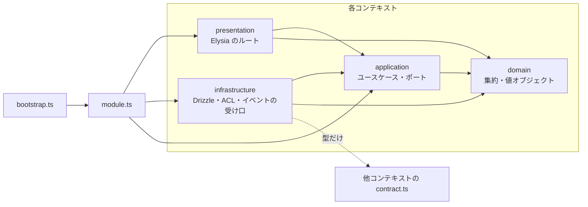
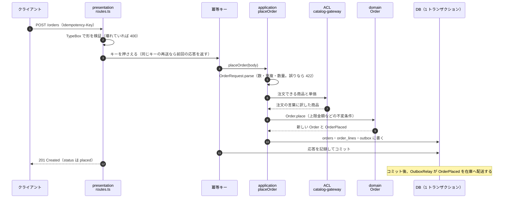

# アーキテクチャ

1 つのプロセスの中に、境界づけられたコンテキストを 3 つ並べたモジュラーモノリス。各コンテキストの内側は、ドメインを中心にしたヘキサゴナル（ポートとアダプター）の形をしている。

| コンテキスト | 持っているもの | 他との関係 |
| --- | --- | --- |
| catalog（カタログ） | 商品の名前・価格・販売状態、販売数のリードモデル | 上流。注文と在庫に公開 API を出す |
| inventory（在庫） | 商品ごとの在庫、注文ごとの引当の記録 | カタログを ACL 越しに読む。注文とはイベントだけでやりとりする |
| ordering（注文） | 注文とその状態遷移 | カタログを ACL 越しに読む。在庫とはイベントだけでやりとりする |

## ディレクトリ

```
src/
├── main.ts          起動と停止（HTTP・定期ジョブ・DB の順に止める）
├── bootstrap.ts     コンポジションルート。どの実装を使うかを決めるのはここだけ
├── config.ts        環境変数を型付きの設定にする（壊れていれば起動時に落とす）
├── migrate.ts       マイグレーションだけを流す
├── shared/          どのコンテキストにも属さない土台
│   ├── domain/          Result・Brand・DomainEvent・Money・文字列の正規化
│   ├── application/     ポート（Clock・IdGenerator・UnitOfWork・EventPublisher・IdempotencyStore・Logger・Job）
│   ├── infrastructure/  DB 接続・アンビエントトランザクション・Outbox・冪等キー・スケジューラー
│   └── presentation/    Elysia の土台（Problem Details・アクセスログ・冪等キー・OpenAPI）
└── modules/<context>/
    ├── domain/          集約・値オブジェクト・ドメインイベント・リポジトリのインターフェース
    ├── application/     ユースケース・クエリのポート・外部に求めるもののポート
    ├── infrastructure/  Drizzle のリポジトリとクエリ・他コンテキストへの ACL・イベントの受け口
    ├── presentation/    Elysia のルート
    ├── contract.ts      他のコンテキストへの公開窓口
    └── module.ts        コンテキスト内の組み立て
```

## 層と依存の向き



依存は外側から内側へ一方向。守らせているのは `test/architecture.test.ts` で、全ファイルの import を走査して次を確かめる。

| 層 | import してよいもの | 置くもの |
| --- | --- | --- |
| domain | 同じコンテキストの domain、`shared/domain` | 集約、値オブジェクト、ドメインサービス、イベントの型、リポジトリのインターフェース |
| application | 上に加えて application、自分の contract、`shared/application` | ユースケース、クエリのポートと表示用の型、外部に求めることのポート |
| infrastructure | domain・application・infrastructure、他コンテキストの **contract だけ**、任意のパッケージ | リポジトリとクエリの実装、ACL、イベントの受け口、テーブル定義 |
| presentation | domain・application・presentation、`elysia` と `@elysiajs/*` | ルート、HTTP のスキーマ、エラー → ステータスの表 |
| module.ts | 自分のコンテキストのすべて、他コンテキストの contract | 組み立てだけ |

さらに、domain と application では `Date.now()`・`new Date()`・`Math.random()`・`Bun.*`・`process.*` を使えない。時刻と ID は `Clock` と `IdGenerator` から受け取るので、テストで時間を進めたり ID を固定したりできる。

## モジュールの形

各コンテキストは 2 つのファイルで外とつながる。

- **`contract.ts`**: 他のコンテキストが import してよい唯一のファイル。カタログは `CatalogApi`（同期の問い合わせ）を、在庫と注文はイベントの型（Published Language）を出す。集約やリポジトリは見せない。
- **`module.ts`**: リポジトリ・ユースケース・ルート・購読・定期ジョブを組み立てて返す。呼ぶのは `bootstrap.ts` だけ。

`bootstrap.ts` は上流から順に組み立てる。

```ts
const catalog = createCatalogModule({ db, unitOfWork, clock, ids });
const inventory = createInventoryModule({ ..., catalog: catalog.api });
const ordering = createOrderingModule({ ..., catalog: catalog.api });
const relay = createOutboxRelay({ subscriptions: [...catalog.subscriptions, ...inventory.subscriptions, ...ordering.subscriptions], ... });
const app = httpApp(logger, options).use(catalog.routes).use(inventory.routes).use(ordering.routes);
```

在庫と注文はお互いを import しない（イベントの型を contract から読むだけ）。同期の呼び出しはカタログへの問い合わせだけなので、コンテキスト間の依存に循環は無い。

## POST /orders の流れ



注文は受け付けた時点では **placed（在庫の確保待ち）**。在庫の引当はイベントを受けた在庫コンテキストが行い、その結果で confirmed か rejected になる（[messaging.md](messaging.md)）。

## トランザクション

- **アンビエントトランザクション**: `createTransactionScope`（`shared/infrastructure/transaction.ts`）が AsyncLocalStorage に実行中のトランザクションを載せる。リポジトリは `db()` を呼ぶたびに「いまのトランザクション、無ければ接続プール」を受け取るので、ユースケースは tx を引数で回さない。
- **UnitOfWork**: アプリケーション層が知っているのはこれだけ。`run(work)` は `Err` を返すか例外を投げるとロールバックする。入れ子はセーブポイントになり、内側の失敗は内側の書き込みだけを戻す。
- **短く張る**: `placeOrder` は検証とカタログへの問い合わせをトランザクションの外で済ませ、書き込み（注文の保存と outbox への記録）の間だけ張る。
- **DB が検出した衝突**: シリアライゼーション失敗（SQLSTATE 40001）とデッドロック（40P01）は `ConcurrencyError` に読み替える。HTTP では 409、イベントの配送ではリトライになる。

同時更新への備えは 2 通りを使い分けている。

| 対象 | 方式 | 理由 |
| --- | --- | --- |
| 注文・商品・引当の記録 | 楽観ロック（`version` 列） | 同じ行を同時に触ることがまれ。衝突したら `retryOnConflict` で読み直してやり直す |
| 在庫（StockItem） | 悲観ロック（`SELECT … FOR UPDATE`、商品 ID の順） | 人気商品には引当が集中する。やり直しの連鎖より順番待ちのほうが速く、ID 順に取ればデッドロックしない |

## エラーの扱い

| 種類 | 表し方 | HTTP |
| --- | --- | --- |
| 入力の形が違う（型・必須・UUID の書式） | Elysia の検証が止める | 400 |
| 業務ルール違反（数量・上限・在庫・状態遷移） | ユースケースが `Result` の `Err` で返す | 表で決める（422・409 など） |
| 見つからない | `Err`（`OrderNotFound` など） | 404 |
| 同時更新の衝突 | `ConcurrencyError` を投げる | 409 |
| 想定外（バグ・DB 断・応答がスキーマに合わない） | 例外 | 500（詳細はログだけ） |

業務エラーは RFC 9457 の Problem Details で返す。`type` は `urn:problem:<エラー名>`、エラーの項目（`productIds` など）は拡張メンバーとしてそのまま載せる。エラー名と HTTP ステータスの対応は各コンテキストの `presentation/routes.ts` の表に書き、表に無いエラー名が来るとコンパイルが通らない。ドメインエラーが Problem Details の予約名（`status`・`title`・`instance`）を持つことも型で禁じている（注文の状態を `status` という名前で返そうとして HTTP ステータスを上書きした不具合が実際にあったため）。

## HTTP の土台

`shared/presentation/http-app.ts` が全ルート共通の土台を作る。

- `x-request-id` を引き継ぐ（無ければ UUIDv7 を振る）。応答後に 1 行 1 JSON のアクセスログを出す。
- 本文が `MAX_BODY_BYTES` を超えたら、パースする前に 413 を返す。
- `/openapi` に Scalar の API ドキュメント、`/openapi/json` に仕様を出す。
- `Idempotency-Key` はルートごとに `idempotent(context, work)` で包んで使う（注文と入荷で使っている）。

クライアントは `import type { App } from "./src/bootstrap"` と Eden Treaty で、HTTP の型をそのまま使える。API のテストも Eden で書いている。

## コンテキストを足す手順

1. `src/modules/<name>/` に domain → application → infrastructure → presentation の順で作る。
2. テーブルは `infrastructure/schema.ts` に `pgSchema("<name>")` で定義し、`bun run db:generate` でマイグレーションを作る。
3. 他のコンテキストに見せるものだけを `contract.ts` に出す。他のコンテキストを読むときは、自分の application にポートを定義し、infrastructure に ACL を置く。
4. `module.ts` で組み立て、`src/bootstrap.ts` でルートを `.use()` し、購読を OutboxRelay に、定期ジョブをスケジューラーに渡す。
5. `bun run check` を流す。依存の向きを破っていれば `test/architecture.test.ts` が落ちる。
