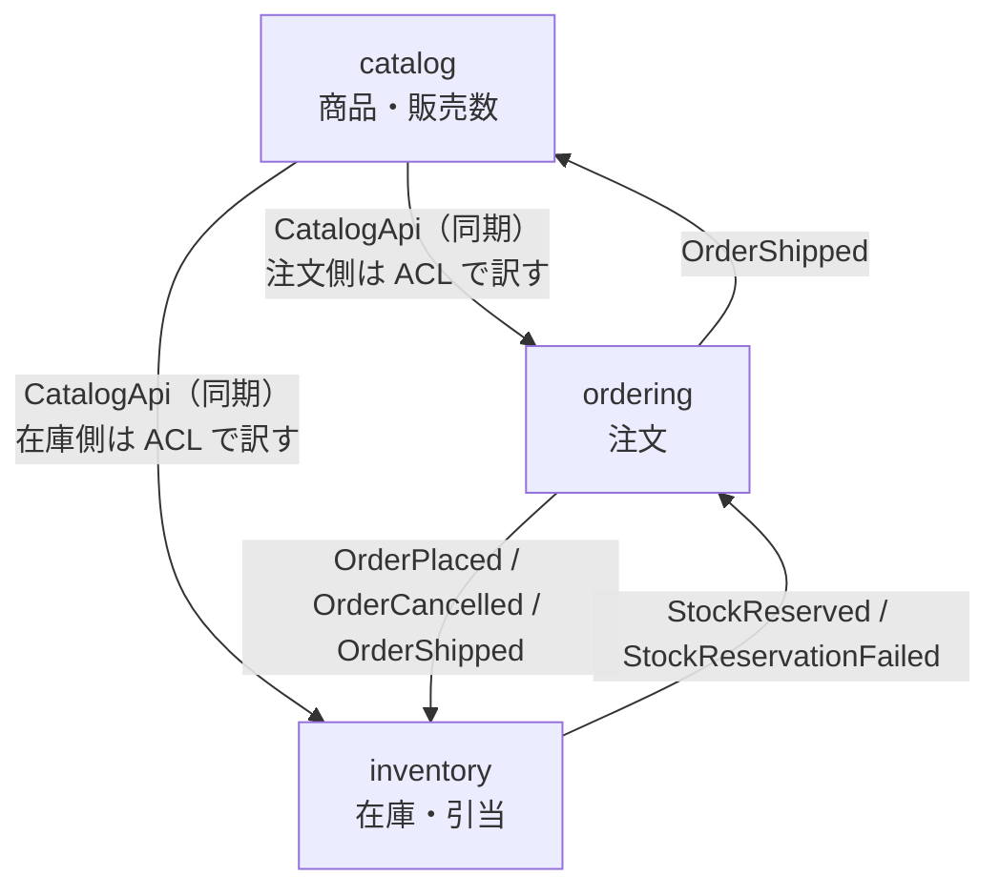
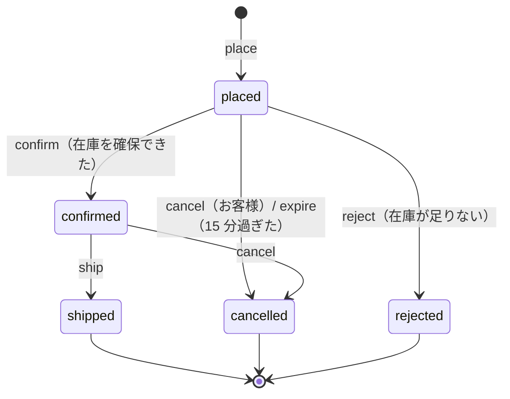
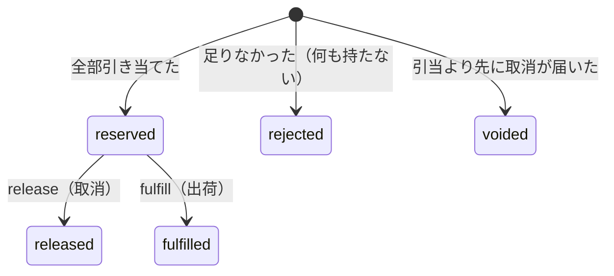

# ドメインモデル

## コンテキストの関係



- **カタログは上流**。`CatalogApi`（Open Host Service）を公開し、注文と在庫はそれぞれの ACL（`infrastructure/catalog-gateway.ts`）で自分の言葉に訳して使う。注文は「注文できる商品と単価」、在庫は「その商品があるか」だけを知りたい。
- **在庫と注文はイベントだけでつながる**。どちらも相手のイベントの型を `contract.ts` から読むが、相手のコードは呼ばない。受け口（`infrastructure/*-events.ts`）が相手の言葉を自分のユースケースに訳す。
- **ID の型は共有しない**。注文の `ProductId` と在庫の `ProductId` は別のブランド型。コンテキストをまたぐときは必ず ACL で作り直す。

## 注文（ordering）

### 集約 Order

| 要素 | 内容 |
| --- | --- |
| ルート | `Order`（`domain/order.ts`）。コンストラクタは private で、作るのは `place`、復元は `reconstitute` だけ |
| 内側のエンティティ | 明細 `OrderLine`（商品名と単価は注文時点の値を写し取る） |
| 不変条件 | 明細は 1〜50 行、同じ商品は 1 行だけ、合計は 100 万円まで、状態遷移は遷移表のとおり |
| 状態を変える操作 | `confirm`・`reject`・`cancel`・`expire`・`ship`。どれも「新しい Order」と「イベント」を返し、自分は書き換えない |

### 状態遷移



遷移の可否は `ORDER_TRANSITIONS` という表にだけ書いてある。

```ts
export const ORDER_TRANSITIONS = {
  placed: ["confirm", "reject", "expire", "cancel"],
  confirmed: ["ship", "cancel"],
  shipped: [],
  cancelled: [],
  rejected: [],
} as const satisfies Record<OrderStatus, readonly OrderAction[]>;
```

この表から 3 つのものを作っている。

1. **実行時の判定**: `require(action)` が表を引き、できない操作は `InvalidOrderTransition`（HTTP 409）にする。
2. **型**: `StateAllowing<"ship">` は「ship を受け付ける状態」＝ confirmed の型になる。`ship` の中では `confirmedAt` を型の上で安全に読める。表を変えると各メソッドの型も変わる。
3. **API の `actions`**: 注文を返すときに「いまできる操作」（cancel・ship）を添える。クライアントが遷移表を二重に持たなくてよい。

状態ごとに持てる値は判別共用体で分けている。

```ts
type OrderState =
  | { status: "placed" }
  | { status: "confirmed"; confirmedAt: Date }
  | { status: "shipped"; confirmedAt: Date; shippedAt: Date; trackingNumber: TrackingNumber }
  | { status: "cancelled"; cancelledAt: Date; cancelledBy: "customer" | "system"; reason: CancelReason; confirmedAt: Date | null }
  | { status: "rejected"; rejectedAt: Date; unavailableProductIds: readonly ProductId[] };
```

「出荷済みなのに追跡番号が無い」状態は型の上で作れない。DB でも状態ごとの必須列を CHECK 制約で守る（`infrastructure/schema.ts`）。

### 時間に依存する規則

在庫の確保を待つのは 15 分（`CONFIRMATION_DEADLINE_MS`）。`order.expire(now)` は期限の 1 ミリ秒前なら `ConfirmationNotOverdue` で断り、期限ちょうどから取り消せる。現在時刻は引数で受け取るので、境界をテストで正確に突ける。定期ジョブ `ordering.expire-overdue-orders` が候補を探し、1 件ずつ `expire` を呼ぶ。

### 値オブジェクト

| 型 | 規則 |
| --- | --- |
| `Quantity` | 1〜99 の整数 |
| `CancelReason` | NFC に正規化して前後の空白を落とし、見た目の文字数で 1〜200。改行は可、ほかの制御文字は不可 |
| `TrackingNumber` | NFKC で全角英数字を半角に、英字を大文字に。8〜30 文字の英数字とハイフン（端はハイフン不可） |
| `OrderRequest` | 価格を引く前に確かめられる条件（数・重複・数量）をまとめて検査する。1 万行の注文でカタログに問い合わせない |

## 在庫（inventory）

### 集約 StockItem

商品ごとの在庫。`onHand`（倉庫にある数）、`reserved`（注文に引き当て済みの数）、`available = onHand − reserved`。不変条件は `0 ≤ reserved ≤ onHand ≤ 1,000,000` で、DB の CHECK 制約でも守る。

| 操作 | 変化 | 失敗 |
| --- | --- | --- |
| `receive(q)` | onHand += q | 上限を超える → `StockLimitExceeded` |
| `reserve(q)` | reserved += q | available が足りない → `InsufficientStock` |
| `release(q)` | reserved −= q | 引き当てた以上を戻す → バグとして例外 |
| `fulfill(q)` | onHand −= q、reserved −= q | 引き当てた以上を出す → バグとして例外 |

### 集約 Reservation（注文ごとの引当の記録）

どの注文に何を引き当てたかを覚えておく集約。これがあるので、イベントが重複しても、順番が入れ替わって届いても、在庫を二重に動かさない。



| いまの状態 | 取消（release）が来たら | 出荷（fulfill）が来たら | 引当（OrderPlaced）が来たら |
| --- | --- | --- | --- |
| 記録なし | voided を記録（あとから来る引当を断る） | 不整合として例外 | 引き当てる |
| reserved | 在庫に戻して released | 在庫から出して fulfilled | 何もしない |
| rejected / voided / released | 何もしない | 不整合として例外 | 何もしない |
| fulfilled | 不整合として例外 | 何もしない | 何もしない |

「不整合として例外」は、注文側の遷移表が許さないので起きないはずの組み合わせ。黙って握りつぶさず、リトライとデッドレターで人が気づけるようにしている。

### ドメインサービス allocate

注文 1 件分の在庫を **全部引き当てるか、何も引き当てないか** で決める（`domain/allocation.ts`）。複数の StockItem にまたがる判断なので、どの集約のメソッドにもできない。

- 同じ商品が複数行あれば合算してから判断する（上流が重複を許すようになっても数え間違えない）。
- 一度も入荷していない商品は在庫 0 として扱う。
- 1 つでも足りなければ、不足をすべて（商品・求めた数・あった数）報告し、どの在庫も動かさない。

1 つのトランザクションで複数の集約（StockItem）を変えるのは「1 トランザクション 1 集約」の原則から外れるが、「注文単位で全部か無しか」が業務の要求なので、ここでは意図して外している。代わりに、ロックを商品 ID の順に取ってデッドロックを避けている。

## カタログ（catalog）

集約 `Product`（名前・価格・販売状態）。販売終了は 1 回だけで、2 回目は `ProductAlreadyDiscontinued`（409）。商品名は NFC に正規化し、見た目の文字数で 1〜100、制御文字は不可。

販売数（`unitsSold`）は集約ではなくリードモデル。`OrderShipped` を受けて出荷した数量だけを数える。出荷後の注文は取り消せないので、足した数を引き戻す必要が無い。

## イベント

| イベント | 出すところ | 受けるところ | ペイロード |
| --- | --- | --- | --- |
| `ordering.OrderPlaced` | 注文を受け付けたとき | 在庫（引当） | 顧客、明細（商品・数量・単価）、合計 |
| `ordering.OrderConfirmed` | 在庫を確保できたとき | （なし） | なし |
| `ordering.OrderRejected` | 在庫が足りなかったとき | （なし） | 足りなかった商品 |
| `ordering.OrderCancelled` | お客様の取消・期限切れ | 在庫（戻す） | 理由、取り消した主体（customer / system） |
| `ordering.OrderShipped` | 出荷したとき | 在庫（出庫）、カタログ（販売数） | 追跡番号、明細 |
| `inventory.StockReserved` | 全部引き当てたとき | 注文（確定） | 注文 ID |
| `inventory.StockReservationFailed` | 足りなかったとき | 注文（却下） | 注文 ID、不足の一覧 |

ペイロードはブランド型ではなく素の値（文字列・数値）にしている。JSON で outbox に保存し、他のコンテキストが読むので、ここが外との約束（Published Language）になる。受け手が使わない項目は増やさない（在庫は取消のときに明細を受け取らず、自分の引当記録を使う）。
