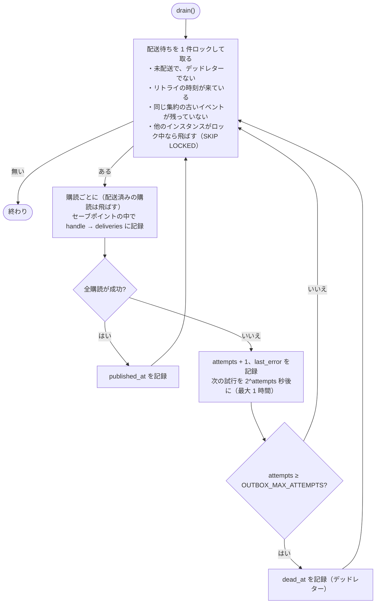
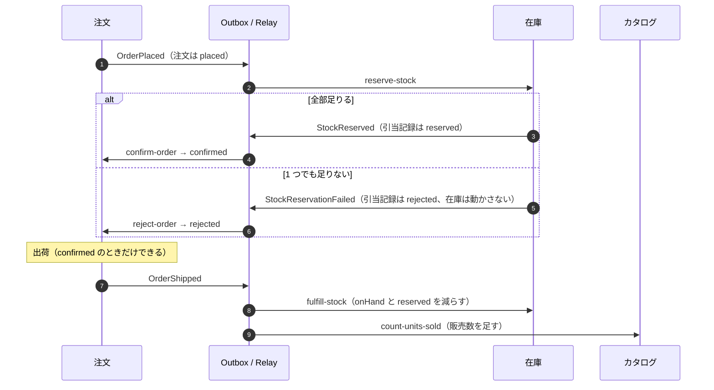
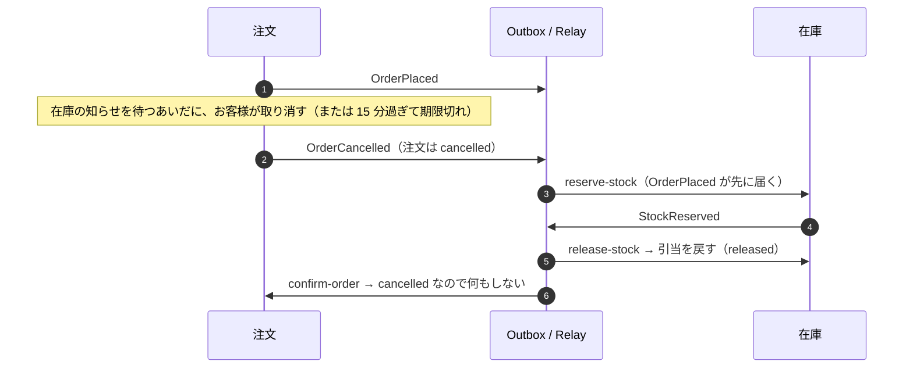

# イベントと Saga

コンテキスト間の非同期のやりとりは、すべて同じ DB の上の Transactional Outbox を通る。メッセージブローカーは使っていない。

## Transactional Outbox

集約の変更とイベントを **同じトランザクション** で書く。ユースケースは `EventPublisher.publish` を UnitOfWork の中で呼ぶだけで、実装（`shared/infrastructure/outbox/publisher.ts`）は `messaging.outbox` に行を足す。

- 集約の保存が失敗すれば、イベントも残らない（ロールバックした操作のイベントは出ない）。
- 集約の保存に成功すれば、イベントも必ず残る（「DB は更新されたのにイベントが消えた」が起きない）。

配送はコミットのあとで `OutboxRelay`（`relay.ts`）が行う。定期ジョブ `outbox.deliver` が `OUTBOX_POLL_MS` ごとに `drain()` を呼ぶ。

## 配送の手順



この手順で次のことが成り立つ。

| 性質 | 仕組み |
| --- | --- |
| 同じ DB に書くだけの購読は、二重に適用されない | 購読の書き込みと「配送済み」の記録（`messaging.deliveries`）を同じトランザクションで確定する |
| 購読の 1 つが失敗しても、ほかを巻き込まない | 購読ごとにセーブポイントを切り、失敗した購読の書き込みだけを戻す。成功した購読は deliveries に残り、リトライで飛ばされる |
| 同じ集約のイベントは積まれた順に届く | 同じ `aggregate_id` の古いイベントが配送待ちなら、新しいものは待つ（ほかの集約は待たせない） |
| 何度やっても失敗するイベントが、後続を止め続けない | `OUTBOX_MAX_ATTEMPTS` 回でデッドレターにし、配送の対象から外す |
| 複数インスタンスで動かしても取り合わない | `SELECT … FOR UPDATE SKIP LOCKED` で 1 件ずつ取る |
| 購読が新しく積んだイベントも続けて流れる | `drain()` は配送できるものが無くなるまで繰り返す |

外部のサービスを呼ぶ購読（メール送信など）は、DB と同じトランザクションに入れられないので「少なくとも 1 回」になる。そういう購読は、受け取った側で重複を捨てられるように作る（冪等キーを渡す、など）。

購読の名前（`subscribe("inventory.reserve-stock", ...)` の第 1 引数）は deliveries の記録に使う。運用に乗せたあとに名前を変えると、過去のイベントがその購読にもう一度届くので変えない。

## 注文と在庫の Saga

注文の確定には在庫コンテキストの判断が要る。オーケストレーター（全体の進行を持つ役）は置かず、お互いのイベントに反応して進むコレオグラフィ型にしている。

### 確保できたとき・足りなかったとき



### 取消と期限切れ（補償）

取消は Saga の補償にあたる。在庫を引き当てていれば戻し、まだなら「あとから来る引当を断る」記録を残す。



- 同じ注文のイベントは順に届くので、在庫には「引当 → 取消」の順で届き、在庫は必ず元に戻る。
- 確保の知らせ（StockReserved）は取消のあとに届くが、注文は遷移表で断り、何もしない。
- OrderPlaced がデッドレターになって取消だけが先に届いた場合は、在庫が `voided` を記録する。あとで OrderPlaced を手で再開しても、引き当てずに止まる。
- 在庫の知らせがいつまでも来ない注文は、15 分で期限切れになる（`ordering.expire-overdue-orders`、30 秒ごと）。取消と同じ `OrderCancelled`（cancelledBy: system）を出すので、在庫側の扱いは同じ。

### コレオグラフィにした理由と、切り替える目安

いまの流れは 2 者（注文と在庫）で、分岐も「確保できた / できなかった」だけなので、各コンテキストがイベントに反応するだけで追える。支払いや配送業者の手配が加わって、参加者が 3 者以上になったり、「支払いに失敗したら在庫を戻して注文を取り消す」のような複数段の補償が要るようになったら、進行状態を持つプロセスマネージャー（注文ごとの Saga の集約と、その状態遷移表）を注文コンテキストに置く形に切り替える。

## 定期ジョブ

`shared/infrastructure/scheduler.ts` が `Job`（名前・間隔・処理）を動かす。同じ Job の実行が重なりそうなら、その回は飛ばす。

| Job | 間隔 | 内容 |
| --- | --- | --- |
| `outbox.deliver` | `OUTBOX_POLL_MS`（デフォルト 500ms） | イベントを配送する |
| `ordering.expire-overdue-orders` | 30 秒 | 確保待ちのまま 15 分過ぎた注文を取り消す |
| `outbox.purge-published` | 1 時間 | 配送から 7 日たったイベントを消す（deliveries も一緒に消える） |
| `api.purge-idempotency-keys` | 1 時間 | 24 時間たった冪等キーを消す |

複数インスタンスで動かすと Job も台数分動く。どの Job も並行に動いて壊れないように作ってある（配送は SKIP LOCKED、期限切れは楽観ロックで 1 台だけが成功し、ほかは飛ばす）。

## 運用

デッドレターと、配送が滞っているイベントを見る。

```sql
-- デッドレター
select id, type, aggregate_id, attempts, last_error, dead_at
from messaging.outbox where dead_at is not null order by dead_at desc;

-- リトライ待ち（失敗したことがある未配送）
select id, type, aggregate_id, attempts, next_attempt_at, last_error
from messaging.outbox where published_at is null and dead_at is null and attempts > 0;
```

原因を直したら、デッドレターを配送待ちに戻す。成功済みの購読には deliveries の記録があるので、失敗した購読にだけ届く。

```sql
update messaging.outbox
set dead_at = null, attempts = 0, next_attempt_at = now()
where id = '<イベントの id>';
```
